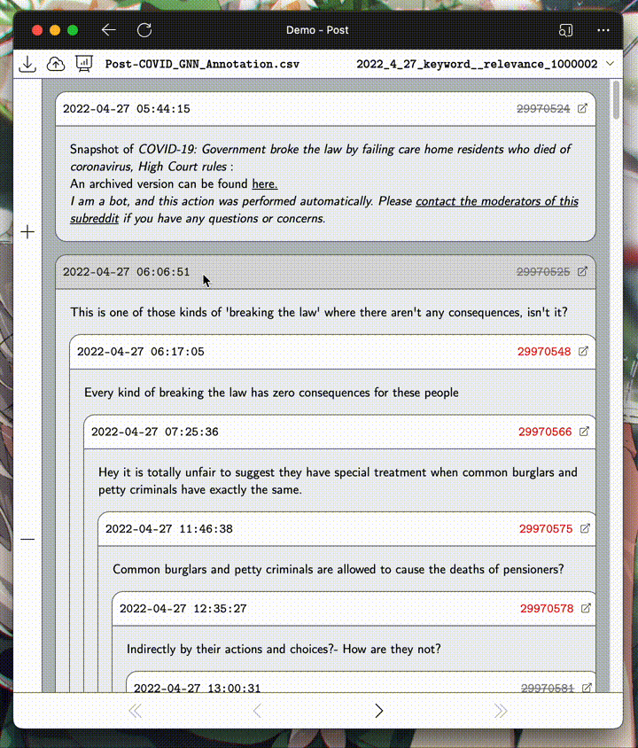

# sentiment-annotator

A simple annotation tool for sentiment analysis research on Reddit.

## Tech Stack

### Client 

- React & Next.js 13, with experimental appDir routing
- Zustand for state management
- Markdown-it for markdown rendering

### Server

- Python & Poetry & FastAPI
- Pandas, with pd.Dataframe in memory as a pseudo database (since I am lazy)

## Demo

